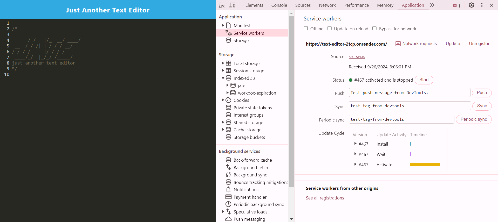
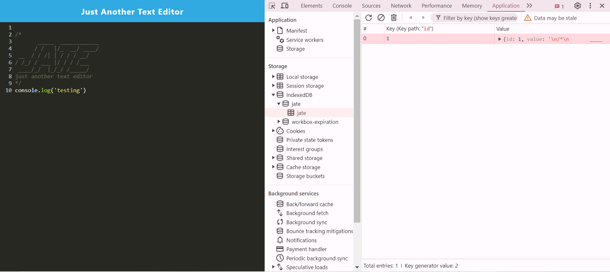
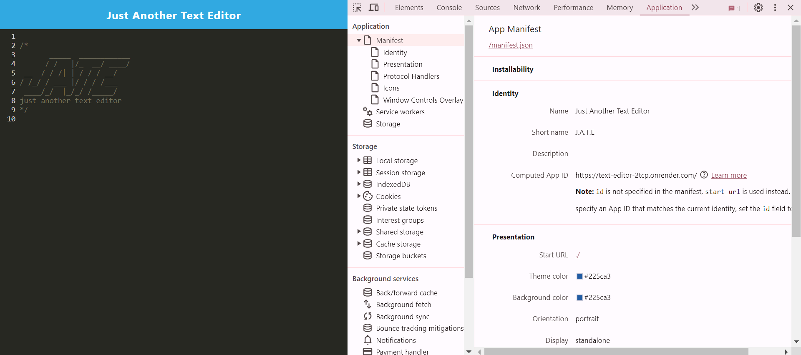

# Text Editor

## Description

This application is a text editor PWA that allows for the user to write lines of code.
## Installation

To install necessary dependencies, run the following command:

...

'npm i'
...

## Usage

To use this application, type lines of code into browser or downloaded app. The text is then saved, and, upon opening or refresh of the PWA, will still be present.

[Deployed Application](https://text-editor-2tcp.onrender.com/)

## Credits

TA: asset caching and PWA configurations
Tutor: Install button functionality

## License

LICENSE in repo.